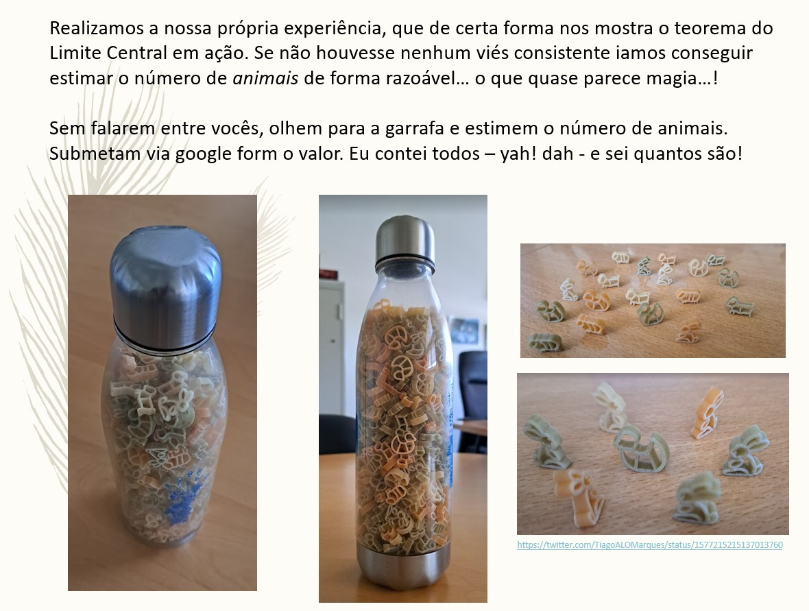
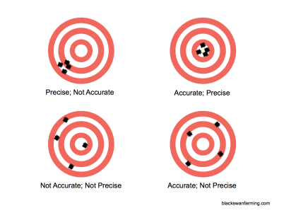

```{r setup, include=FALSE}
knitr::opts_chunk$set(echo = TRUE)
```

# Introduction

This document describes a challenge set to the students in the "Ecologia Numérica" class originally on the 4th Octoober 2022. As with any good survey, there was a pilot survey, that happened last year, on the 27th September 2021.

Some key terms that might be important for students in Ecologia Numérica are higlighted as **bold**.

In fact the challenge was announced on twitter 30 minutes before, but the students had not been explicitly told about it. Thge original post is here:

https://twitter.com/TiagoALOMarques/status/1577215198448218118

The challenge was that the students had to guess how many animals were in a farm. Well, kind of, the animals were small pasta shaped as animals and the farm was a transparent plastic bottle. The image below shows the jar from different perspectives. Sorry for the Portuguese words on the slide, but this is done with Portuguese students.



Then the students were told that they would have to guess what was the number of animals in a jar, with a detail, depending on their student number:

* students with an even number would get a cue 
* students with an odd number would close their eyes and get no cue (and hence have no clue !)

The cue was given. The cue was that I showed the students (with even numbers only) 10 animals in my hand, and added them to the jar. The animal height level barely changed, if at all. I hope that in the subconscious of these students an idea arose... There are many, many, many more than 10 animals there, so I need to estimate a large number. In a way, these students were allowed to **calibrate** their estimates. The other students have no way to calibrate themselves. So I hope that in the end even numbered students will have less *bias* than odd numbered students. So, to recap, there will be several **estimators**, based on a **sample**, the students, belonging to an infinite population of potential students, say. I will consider 3 estimators:

* the average of all students; 
* the average of the odd students (this estimator was uncalibrated)
* the average of the even students (this estimator was somehow/somewhat calibrated)

```{r}
#valor real
N = 708
```

A key aspect of the game is that there were in reality `r N` animals after the 10 from the cue were introduced back in the jar.

Then the students in class guessed the number of animals and the results were reported on a google form


This form created a google spreadsheet (as google forms do!) that was downloaded by TAM and is further processed here. The file was downloaded as a .csv file renamed "GoogleFormData.csv".

Read the data in

```{r}
library(readr)
dados <- read_csv("GoogleFormData.csv")
```

Lets take a look at a summary of the data

```{r}
summary(dados)
```

The time stamp is not really relevant information, since all the students did the experience in class. Further, the comments, are also not that relevant, but I do print them here just for fun though.

```{r}
unique(dados$`Any other comment you might have about the farm?`)
```

We recode the sex and the number of the student as factors, and create a new `data.frame`, for easier use, 

```{r}
dados<-data.frame(estimativa=dados$`How many animals are living in the farm (do not write anything but a number in this field - comments can be added below)`,even=as.factor(dados$`Is your student number odd or even`),
gender=as.factor(dados$`Would you mind sharing your gender?`))
```

and now we take a look at the data again:

```{r}
summary(dados)
```

We can plot the estimates:

```{r}
hist(dados$estimativa,breaks=seq(0,max(dados$estimativa),by=100),main="",xlab="Estimate of the number of animals")
```

Now, the first thing to note is that someone  filled in a value of `r max(dados$estimativa)` animals. I am not certain whether this was a mistake or not, but I'll also remove it here so that we can see the remaining data better.

```{r}
dados2<-dados[dados$estimativa<2500,]
hist(dados2$estimativa,breaks=seq(0,1500,by=100),main="",xlab="Estimate of the number of animals")
```

OK, we're getting somewhere. Any way, let's not remove any data from our estimates. Remember that the true value of the animals in the jar, after the 10 from the cue were added, was `r N` animals. So let's add that to the plot, as a green vertical line, and then the mean of the guesses, as a vertical dashed red line. The blue dashed lines represent the 95% CI.

```{r}
# Here I create an object that will hold just the estimates. 
# I do it in this way because later I'll change some of it but I do not really
# want to change the data
estimativas=dados$estimativa
```

```{r}
#plot correspondente
hist(estimativas,breaks=seq(0,3000,by=100))
abline(v=N,col="green",lty=2)
#ver se o valor é bem estimado
#se N estiver contido podemos dizr que sim!
t.test(estimativas,mu=N)
#equivalente: o valor está contido 
#no intervalo de confiança?
#to get function CI – does confidence intervals
library(Rmisc)
CI(estimativas)
abline(v=CI(estimativas),col=c(4,2,4),lty=3)
legend("topright",legend=c("True N","Mean estimated N","95% CI limits"),col=c("green","red","blue"),lty=c(2,2,3))
```

Clearly - and even though we have not covered a t-test in class yet, you have seen them before - one would reject the null hypothesis that the true mean could be equal to `r N`. The estimates are too far down for that.

```{r}
#equivalente: o valor está contido 
#no intervalo de confiança?
library(Rmisc)
CI(estimativas)[3:1]
#look at quantiles, not as bad...
#quants=quantile(estimativas,probs=c(0.025,0.975))
#abline(v=quants,col="blue",lty=3)
```

Now, and interesting comparison, lets see the estimates per gender

```{r}
with(dados,boxplot(estimativa~gender))
```

Not really much of a difference across males and females, and too small sample size to make inferences about "Outro".

What about those that got the cue versus those that got no cue. We can check the mean value obtained by these students

```{r}
with(dados,boxplot(estimativa~even))
```

However, unlike what I was expcting, the mean value for even numbers was `r with(dados,round(mean(estimativa[even=="Even (par)"])))` and for odd numbers was `r with(dados,round(mean(estimativa[even=="Odd (impar)"])))`. Interestingly, the few folks not EN students where the less biased `r with(dados,round(mean(estimativa[even=="I am not a EN student"])))`, but there was only `r with(dados,sum(even=="I am not a EN student"))` of those and so that might just be a fluke and not yet another proof that EN students are not very good at this game.

Note that if we remove "wild" estimates above 1000 animals, we get a different relationship, which indicates that the average value for the odd numbers was extremely dependent on a few very large values for those, with less bias associated to even numbers than with odd numbers. This can actualy illustrate the importance of removing, or not, some anomalous observations from an analysis. Statisticians usually talk about **outliers**, a term I hate because it makes it seem like there's something wrong with the data, when in fact it might just be that the data are unexpected given the variability we were assuming/expecting for the data.

```{r}
with(dados[dados$estimativa<1000,],boxplot(estimativa~even))
```

Finally, I get what I was expecting and so this is time to say


If you don't know what the TV series show is, don't even talk to me, but, the lesson should be clear.

For those with more information, the even student numbers, in the analogy of the famous image about bias and precision that I've shown you in class, the bias should be lower



the clue, seeing the number of animals in my hand, was like having a glimpse of the target, which in general you never see. You are trying to hit the center, but you do not know what/where the real target is. By providing you a glimpse of the target, we (hoped to remove (some of the) bias.

Even if we consider either just the even numbers or the odd numbers, the 95% does not include the real value. Note these confidence intervals overlap considerably, but the one for odd numbers is actually wider (and hence closer to containing the true value). This happens given the considerably larger variance in estimates for even numbers, including several of the largest values. These students broke my experiment!

```{r}
CI(estimativas[dados$even=="Odd (impar)"])[3:1]
CI(estimativas[dados$even=="Even (par)"])[3:1]
```

Something interesting we can use these data for is to illustrate the effect of increasing sample size on an estimator. Below we show what happens to the confidence limits when you select a (random) sample of only k students (k= 5 to 60) to calculate a confidence interval

```{r}
set.seed(111)
#valor real
n<-length(estimativas)
nstart<-5
par(mfrow=c(1,1),mar=c(4,4,0.5,0.5))
plot(c(0,1.1*max(estimativas)),c(0,n),type="n",ylab="Tamanho Amostra",xlab="Animais 95% CI")
for(i in nstart:(n-nstart)){
  amostra=sample(estimativas,i,replace=FALSE)
  tempCI<-CI(amostra)
  segments(tempCI[1],i,tempCI[3],i)
}
abline(v=c(N,mean(estimativas)),col=c("green","red"))
```

Another point to make is, given that I sampled random samples across the students, if we redid it, the exact intervals found would be different, but the pattern found, that the width of the CI tends to decrease with the sample size, is still valid

```{r}
#valor real
par(mfrow=c(1,1),mar=c(4,4,0.5,0.5))
plot(c(0,1.1*max(estimativas)),c(0,n),type="n",ylab="Tamanho Amostra",xlab="Animais 95% CI")
for(i in nstart:(n-nstart)){
  amostra=sample(estimativas,i,replace=FALSE)
  tempCI<-CI(amostra)
  segments(tempCI[1],i,tempCI[3],i)
}
abline(v=c(N,mean(estimativas)),col=c("green","red"))
```

Note a really interesting point. A few times, with small sample size, the CI overlapped truth. This is not unexpected. With very small sample size, there is huge variance around the mean, so the CI is really wide. You are not really doing better, you just have very small **power** to detect real differences if they existed. The smaller the sample size, the less likely you are to detect a difference if it exists, all else being equal, of course!

Since you guys were horrible at this, the CI's almost never overlap truth... if you were really good at this game, they'd look like this

```{r}
#se fossem não enviesados
estimativas<-rnorm(100,N,200)
par(mfrow=c(1,1),mar=c(4,4,0.5,0.5))
plot(c(0,1.1*max(estimativas)),c(0,n),type="n",ylab="Tamanho Amostra",xlab="Animais 95% CI")
for(i in nstart:(n-nstart)){
  amostra=sample(estimativas,i,replace=FALSE)
  tempCI<-CI(amostra)
  segments(tempCI[1],i,tempCI[3],i)
}
abline(v=c(N,mean(estimativas)),col=c("green","red"),lwd=c(2,1))
```

Not surprising, since I generated the data with a Gaussian random variable with true mean as `r N`, the CI's are now centered on the true value (Note a detail, I generated the data with a standard deviation of 200; any other value could be used and the main messages would hold, but the width of the CI would change proportionally to the variabilitry in my simulated guesses).

Finally, these were all the values

```{r}
sort(dados$estimativa)
#
best<-dados$estimativa[abs(dados$estimativa-N)==min(abs(dados$estimativa-N))]
```

Congratulations to whomever got `r best`, the closest to the truth of `r N`! Look at the .Rmd and see how the number `r best` is obtained automatically by selecting the value for which we observe the minimum of the absolute difference between estimates and truth.

```{r}
dados[dados$estimativa==best,]
```

As it seems, a woman with some clue, but, remember, she's an even number, and she had a cue! (last year it was also a woman, with a cue... is there a patterns there?).

*Disclaimer*: this document was written late at night after a long day of classes. If you find errors or have suggestions for improvements, I'd love to get them! This document .Rmd, the corresponding .html and the data are all shared with the students on moodle!